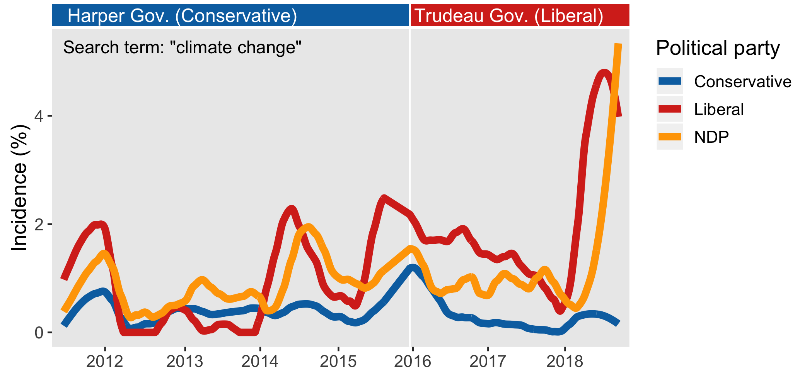

Parliamentary N-Grams: Climate Change
================
Patrick Barks
2019-02-01

Here I use transcripts from the last three sessions of Canadian Parliament (dating back to June 2011) to examine trends in the use of the term "climate change" over time, by political party.

#### Preliminaries

``` r
library(tidyverse)
library(gridExtra)
```

#### Assemble data from three sessions of parliament

``` r
# read main data file
dat <- read_csv("data/parl_full.csv")

# add padding where Parliament took long breaks (e.g. during election)
date_pad1 <- seq.Date(as.Date("2013-09-01"), as.Date("2013-09-12"), by = 1)
date_pad2 <- seq.Date(as.Date("2015-09-01"), as.Date("2015-10-10"), by = 1)
date_pad <- c(date_pad1, date_pad2)

# df of unique dates
df_date <- dat %>% 
  select(date) %>% 
  unique() %>%
  rbind(tibble(date = date_pad)) %>% 
  arrange(date) %>% 
  mutate(date_num = as.integer(as.factor(date)))
```

#### Functions to obtain and smooth percent-occurrence of search term

``` r
PercentOccur <- function(x, search_term, ignore_case = TRUE) {
  len <- length(grep(search_term, x$speech, ignore.case = ignore_case))
  pct <- len / length(x$speech) * 100
  return(data.frame(pct, search_term))
}

SmoothFn <- function(date_num, pct, span = 0.15) {
  smooth <- predict(loess(pct ~ date_num, span = span))
  smooth[smooth < 0] <- 0
  return(smooth)
}
```

#### Get data for search term "climate change"

``` r
# search term and label
term <- "climate change"
term_lab <- paste0("Search term: \"", term, "\"")

# df of search term frequency by party and date
df_term <- dat %>% 
  filter(party %in% c("Lib.", "CPC", "NDP")) %>% 
  group_by(date_num, party) %>% 
  do(PercentOccur(., term)) %>% 
  ungroup() %>% 
  group_by(party) %>% 
  mutate(pct_smooth = SmoothFn(date_num, pct, span = 0.15)) %>% 
  ungroup()

# generate pretty x-labels
df_x <- df_date %>% 
  mutate(year = format(date, "%Y")) %>% 
  mutate(month = format(date, "%m")) %>% 
  group_by(year, month) %>% 
  slice(1) %>% 
  ungroup() %>% 
  filter(month == "01")

# df for government session banner
df_gov <- tibble(gov = c("Harper Gov. (Conservative)",
                         "Trudeau Gov. (Liberal)"),
                 x = c(1, 555) + 6, y = 0.5)
```

#### Plot trends in the use of "climate change" over time, by party

The figure below shows variation in the use of the term "climate change" over time, by political party. Conservatives use the term “climate change” less frequently than the two more left-leaning parties.

``` r
# plot government session banner
ptop <- ggplot() +
  geom_rect(aes(xmin = -Inf, xmax = 552, ymin = 0, ymax = 1), fill = "#0570b0") +
  geom_rect(aes(xmin = 556, xmax = Inf, ymin = 0, ymax = 1), fill = "#d7301f") +
  geom_text(data = df_gov, aes(x = x, y = y, label = gov), col = "white", hjust = 0,
            size = 4.1) +
  scale_x_continuous(expand = c(0.02, 0)) +
  coord_cartesian(xlim = c(0, 887), ylim = c(0, 1)) +
  theme_void() + theme(plot.margin = margin(2, 7, 0, 7))

# plot ngram
pbot <- ggplot(df_term) +
  geom_vline(xintercept = 554, col = "white") +
  geom_line(aes(date_num, pct_smooth, col = party), size = 2.2) +
  annotate("text", x = 0, y = Inf, label = term_lab, hjust = 0, vjust = 1.9) +
  scale_x_continuous(breaks = df_x$date_num, labels = df_x$year, expand = c(0.02, 0)) +
  scale_color_manual(values = c("#0570b0", "#d7301f", "orange"),
                     name = "Political party",
                     labels = c("Conservative", "Liberal", "NDP")) +
  labs(x = NULL, y = "Incidence (%)") +
  theme(panel.grid = element_blank(),
        plot.margin = margin(1, 7, 7, 7),
        text = element_text(size = 13),
        legend.justification = c(1, 1))

# arrange all plots
g1 <- ggplotGrob(ptop)
g2 <- ggplotGrob(pbot)
g1$widths <- g2$widths

grid.arrange(arrangeGrob(g1, g2, heights = c(1, 13)))
```


