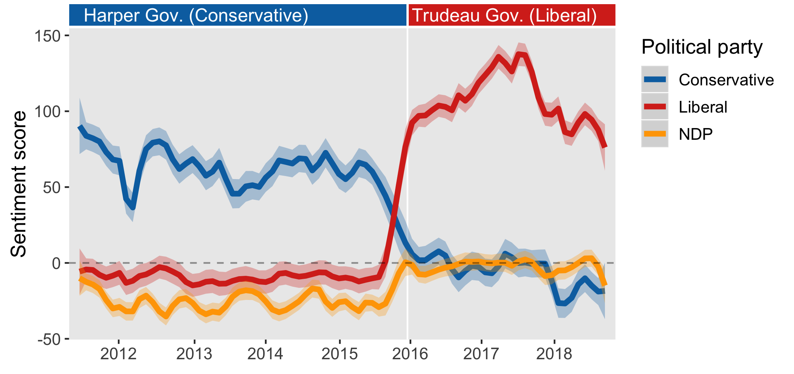

Parliamentary N-Grams: Sentiment
================
Patrick Barks
2019-02-01

Here I use transcripts from the last three sessions of Canadian Parliament (dating back to June 2011) to examine the 'sentiment' of speeches during Question Period by the governing and opposition parties.

#### Preliminaries

``` r
library(tidyverse)
library(tidytext)
library(gridExtra)
```

#### Assemble data from three sessions of parliament

``` r
# read main data file
dat <- read_csv("data/parl_full.csv")

# add padding where Parliament took long breaks (e.g. during election)
date_pad1 <- seq.Date(as.Date("2013-09-01"), as.Date("2013-09-12"), by = 1)
date_pad2 <- seq.Date(as.Date("2015-09-01"), as.Date("2015-10-10"), by = 1)
date_pad <- c(date_pad1, date_pad2)

# df of unique dates
df_date <- dat %>% 
  select(date) %>% 
  unique() %>%
  rbind(tibble(date = date_pad)) %>% 
  arrange(date) %>% 
  mutate(date_num = as.integer(as.factor(date)))
```

#### Functions to obtain and smooth percent-occurrence of search term

``` r
df_token <- dat %>% 
  filter(party %in% c("Lib.", "CPC", "NDP")) %>%
  unnest_tokens(word, speech)
```

#### Get data for search term "climate change"

``` r
bing <- get_sentiments("bing")

sent <- df_token %>%
  inner_join(bing) %>%
  count(party, date_num, sentiment) %>%
  spread(sentiment, n, fill = 0) %>%
  mutate(sentiment = positive - negative)
```

    ## Joining, by = "word"

``` r
df_x <- df_date %>% 
  mutate(year = format(date, "%Y")) %>% 
  mutate(month = format(date, "%m")) %>% 
  group_by(year, month) %>% 
  slice(1) %>% 
  ungroup() %>% 
  filter(month == "01")

df_gov <- tibble(gov = c("Harper Gov. (Conservative)",
                         "Trudeau Gov. (Liberal)"),
                 x = c(1, 555) + 6, y = 0.5)
```

#### Plot sentiment scores over time, by party

The figure below shows sentiment scores (positive values indicate 'positive sentiment') for speeches during Question Period in the Canadian Parliament. While the Conservatives were in power between 2011 and 2015, the sentiment of speeches by Conservative members was generally positive, whereas speeches by the opposition members were generally negative. In late 2015 when the Liberal party rose to power, the sentiment scores among Convservatives and Liberals flipped. The governing party is always positive and optomistic whereas the opposition is negative.

``` r
# plot government session banner
ptop <- ggplot() +
  geom_rect(aes(xmin = -Inf, xmax = 552, ymin = 0, ymax = 1), fill = "#0570b0") +
  geom_rect(aes(xmin = 556, xmax = Inf, ymin = 0, ymax = 1), fill = "#d7301f") +
  geom_text(data = df_gov, aes(x = x, y = y, label = gov), col = "white", hjust = 0,
            size = 4.1) +
  scale_x_continuous(expand = c(0.02, 0)) +
  coord_cartesian(xlim = c(0, 887), ylim = c(0, 1)) +
  theme_void() + theme(plot.margin = margin(2, 7, 0, 7))

# sentiment plot
pbot <- ggplot(sent, aes(date_num, sentiment, col = party, fill = party)) +
  geom_vline(xintercept = 554, col = "white") +
  geom_smooth(method = "loess", span = 0.08, alpha = 0.3, size = 1.7) +
  geom_hline(yintercept = 0, linetype = 2, alpha = 0.4) +
  scale_color_manual(values = c("#0570b0", "#d7301f", "orange"),
                     name = "Political party",
                     labels = c("Conservative", "Liberal", "NDP")) +
  scale_fill_manual(values = c("#0570b0", "#d7301f", "orange"), guide = FALSE) +
  scale_x_continuous(breaks = df_x$date_num, labels = df_x$year, expand = c(0.02, 0)) +
  labs(x = NULL, y = "Sentiment score") +
  theme(panel.grid = element_blank(),
        plot.margin = margin(1, 7, 7, 7),
        text = element_text(size = 13),
        legend.justification = c(1, 1))

g1 <- ggplotGrob(ptop)
g2 <- ggplotGrob(pbot)
g1$widths <- g2$widths

grid.arrange(arrangeGrob(g1, g2, heights = c(1, 13)))
```


